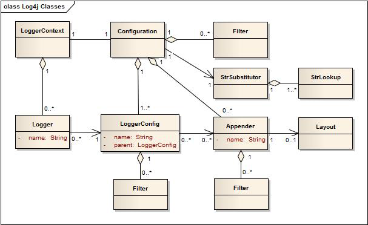

###2.1.1 主要组件

Log4j常用类图如下所示：

在程序中使用Log4j 2要求使用LogManager生成专用的Logger对象，LogManager将会找到合适的LoggerContext然后生成Logger对象。如果必须创建Logger对象，它将与LoggerConfig关联，LoggerConfig包含：
	a) 与Logger相同的名称
	b) 父级包名
	或
	c) 根LoggerConfig
LoggerConfig对象创建于配置的Logger声明，LoggerConfig与实际传递的LogEvents的Appenders相关联

####2.1.1.1 Logger的层级结构

任何日志API的首要优势在于能够平滑`System.out.println`，它能够禁用某些日志语句，同时允许其它事件无阻碍的打印。此功能假定为日志记录空间，也就是说，所有可能的日志语句的空间，都会根据开发者选择的标准分类

在Log4j 1.x版本中，Logger的层级结构通过Logger之间的关系来维护，在Log4j 2中，这种关系不再存在，取而代之的是，层级结构由LoggerConfig对象之间的关系来维护

多个Logger与LoggerConfig被命名为实体，Logger名称区分大小写且遵循如下层次命名规范：

**命名层次结构**

	子LoggerConfig的名称为父级LoggerConfig加"."前缀命名，一个父级LoggerConfig在其自身与子LoggerConfig之间没有父级LoggerConfig

如：命名为`com.foo`的LoggerConfig是命名为`com.foo.bar`LoggerConfig的父级，相应的，命名为`java`的是命名为`java.util`以及`java.util.Vector`的父级，这是大多数开发者需要知道的命名规范

根LoggerConfig在层级结构的顶层，它是个特例，总是存在且是每一层级结构的一部分。根LoggerConfig可以通过如下方式：
	
	Logger logger = LogManager.getLogger(LogManager.ROOT_LOGGER_NAME);

或通过更简洁的：

	Logger logger = LogManager.getRootLogger();

所有的Logger对象可以使用**Logger名**通过静态方法`LogManager.getLogger`获取，更多API信息请参见：[Log4j 2 API.](#API)

####2.1.1.2 LoggerContext对象

LoggerContext对象扮演着日志系统的锚点角色，然而，根据应用环境我们可以拥有多个有效的LoggerContext对象。详情请参见：[Log Separation章节](#Log Separation)

####2.1.1.3 Configuration对象

每个LoggerContext拥有一个活跃的Configuration对象，这个Configuration包含所有的Appender、上下文范围的Filter、LoggerConfig以及包含对StrSubstitutor的引用。在更改配置文件期间，会有两个Configuration对象并存，一旦所有的Logger对象已经传入到新的Configuration，那么旧的Configuration将被废弃。

####2.1.1.4 Logger对象

