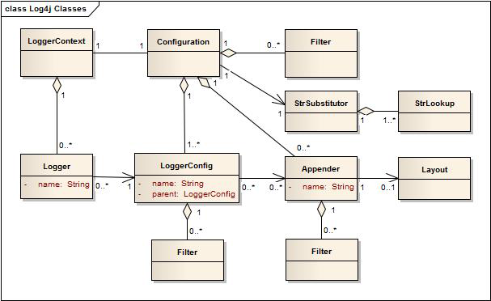

##2.1 Architecture

###2.1.1 主要组件

Log4j常用类图如下所示：

在程序中使用Log4j 2要求使用LogManager生成专用的Logger对象，LogManager将会找到合适的LoggerContext然后生成Logger对象。如果必须创建Logger对象，它将与LoggerConfig关联，LoggerConfig包含：
	a) 与Logger相同的名称
	b) 父级包名
	或
	c) 根LoggerConfig
LoggerConfig对象创建于配置的Logger声明，LoggerConfig与实际传递的LogEvents的Appenders相关联